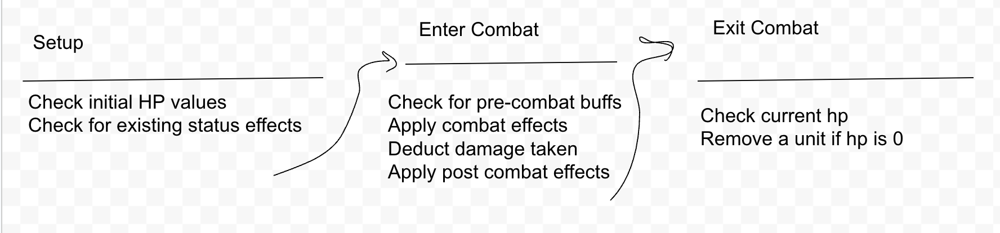

Dennis Sun
300111813
SEG 4105
Lab 3

# Link to repo
https://github.com/SunnyD01/Cards2ElectricBoogaloo

### Links to group members
1. https://github.com/MichaelBosciglio/seg4105_playground/blob/main/lab03/README.md
2. https://github.com/ChetanMandur/seg4105_playground/blob/main/lab03/README.md
3. https://github.com/Macomatic/seg4105_playground/blob/main/lab03/README.md
4. https://github.com/hongyuewang/seg4105_playground/tree/main/lab03

## Problem

Currently the game combat system only takes into account basic attacks and defense. It does not have a clear logic for what effects take place first. Certain effects and interactions will overwrite other effects and cause attacks or status effects not to apply

## Appetite

We aim to complete this feature in 6 weeks. While it is important to spend too much time on a single feature, this is a core feature of the game. Therefore if we require more than 6 weeks, another cycle will be used. However, we are not expecting this to exceed the 6 weeks of allocated time to build and test.

## Solution

We will implement a class function to accept the two units entering combat. The class will have a priority list of which effects take place first. It will also check what status effects are on the units already as this may affect the priority if later effects

## Rabbit Holes

We don't forsee any rabbit holes at the moment, but we should avoid spending too much time modifying other classes to make this system work

## No goes

When we are implementing this, we may discover some effects do not behave the way we expect or certain effects do not interact with each other the way we want them to. Fixing those effects will not be a part of this cycle. Resolving bugs will be part of another cycle