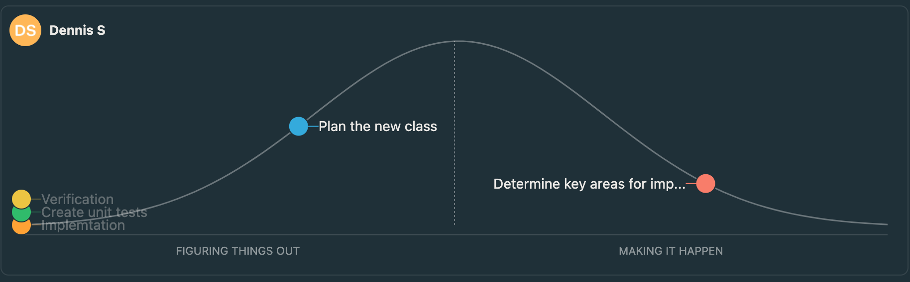

## Tasks completed
https://github.com/SunnyD01/Cards2ElectricBoogaloo/commit/3c558fbbf08a4210a92207345aa40d063857f287

- Analysis of the existing framework and functions
- Identified areas for improvement
    - Spell binding => Non damaging spells currently are able to bypass spell shield(Rainbow shield etc)
There may be some edge cases that still do not work but that what outside the scope of this.
I have made a series of tests to validate the issues I found.

## What I have planned for next week
Busy week next week so this week's task is smaller.
I want to create automated unit tests out of the tests steps outlined from the previous week.

## Blockers
None at the moment
- Potentially could run into a problem with PajaritoPathfinder to store and save state properly with some changes

## Hillchart
